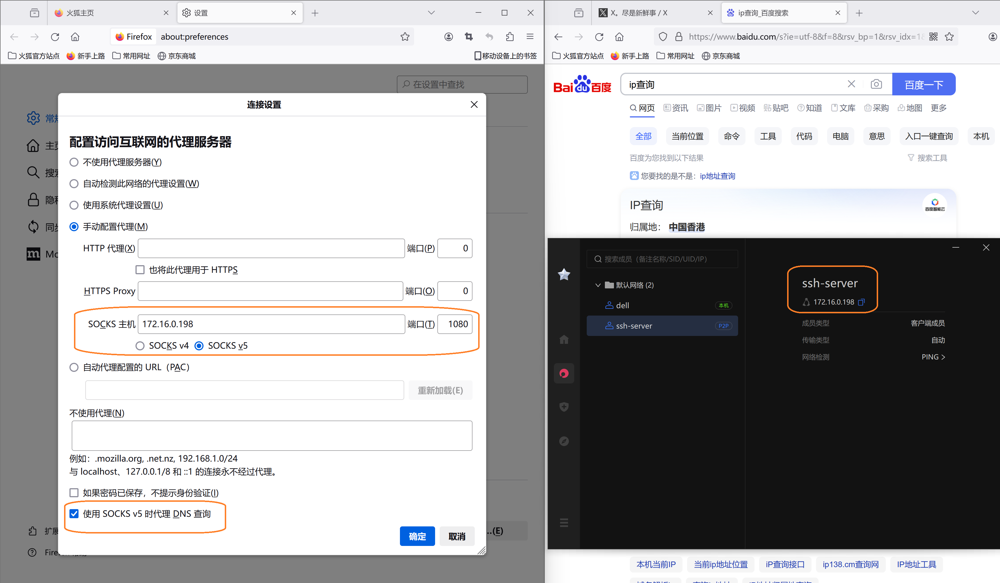

# PgyVisitorEnt_SocksV5

这里介绍一种简易的翻墙方法：使用外网ubutu服务器Dante Server SocksV5代理+蒲公英组网


## 1.1本地电脑安装蒲公英

- 客户端windows下载并安装：https://d.oray.com/pgy/windows/PgyVisitor_6.3.0_x64.exe
- 客户端windows登录贝锐账号，没有账号先创建账号，免费的可以组网三台设备，如果家里一台电脑，公司一台电脑，服务器一台电脑，这样免费的刚刚好。
- 客户端windows在蒲公英客户端软件中取得服务器蒲公英网络ip如：172.16.0.198

## 1.2外网服务器安装蒲公英

- 服务器linux命令行下载蒲公英：wget https://pgy.oray.com/softwares/153/download/2156/PgyVisitor_6.2.0_x86_64.deb
- 服务器linux命令行安装蒲公英：sudo dpkg -i PgyVisitor_6.2.0_x86_64.deb
- 服务器linux命令行登录之前注册的贝锐账号：pgyvisitor login

## 1.3外网服务器安装配置dante-server

- sudo apt install dante-server#服务器安装socksv5代理
- sudo nano /etc/danted.conf #修改配置,添加至末尾：内网网卡oray_vnc通过ifconfig查看出来的 外网网卡eth0

```
internal: oray_vnc port = 1080
external: eth0
method: username none
user.privileged: root
user.unprivileged: nobody
client pass {
    from: 0.0.0.0/0 to: 0.0.0.0/0
    log: error connect disconnect
}
socks pass {
    from: 0.0.0.0/0 to: 0.0.0.0/0
    log: error connect disconnect
}

```

- sudo systemctl start danted #启动danted服务
- sudo systemctl enable danted #开机自运行

## 1.4客户端windows全局代理上网

- 客户端windows编辑一个.reg后缀的文件,内容如下

```
Windows Registry Editor Version 5.00

[HKEY_CURRENT_USER\SOFTWARE\Microsoft\Windows\CurrentVersion\Internet Settings]

"ProxyServer"="socks://172.16.0.198:1080"
```

- 客户端windows左下角搜索框中搜索“代理”：进入网络和Internet>代理>手动代理点上“开”代理ip填入socks://172.16.0.198 端口填入1080
- 客户端windows双击运行reg文件注册表注入后即可使windows全局用本地socks://172.16.0.198:1080上网，如果服务器放在“外地”的话就可以用“外地”的网络了上网，腾讯，阿里，UCLOUD......都可以。

## 1.5客户端火狐浏览器代理上网

- 火狐浏览器设置中搜代理进入网络设置下面选手动代理SOCKS主机填入127.0.0.1 SOCKS v5选项 另外“使用SOCKSv5 时代理DNS查询” 这个要勾上。

## 1.6另外一种方法；用ssh不用danted

本地电脑命令行运行建立ssh通道，192.168.1.123是本地局域网ip，如果用这个办法的话上面填“172.16.0.198”要改填“192.168.1.123”，这个办法的好处是本地局域网内只要有一台连接蒲公英网络其他，在这台电脑建立ssh通道后局域网内其他电脑也可以利用这个通道翻墙：

- ssh -N -D 192.168.1.123:1080 ubuntu@172.16.0.198

### 每次输入密码很麻烦，SSH 无密码登录服务器的办法

- 1、本地windows命令行运行：ssh-keygen -t rsa
- 2、本地windows命令行到.ssh文件夹：cd .ssh
- 3、本地windows命令行上传公钥文件到linux服务器：scp id_rsa.pub ubuntu@172.16.0.198:~/.ssh/authorized_keys
- 4、本地windows命令行无密码登录linux服务器：ssh ubuntu@172.16.0.198
